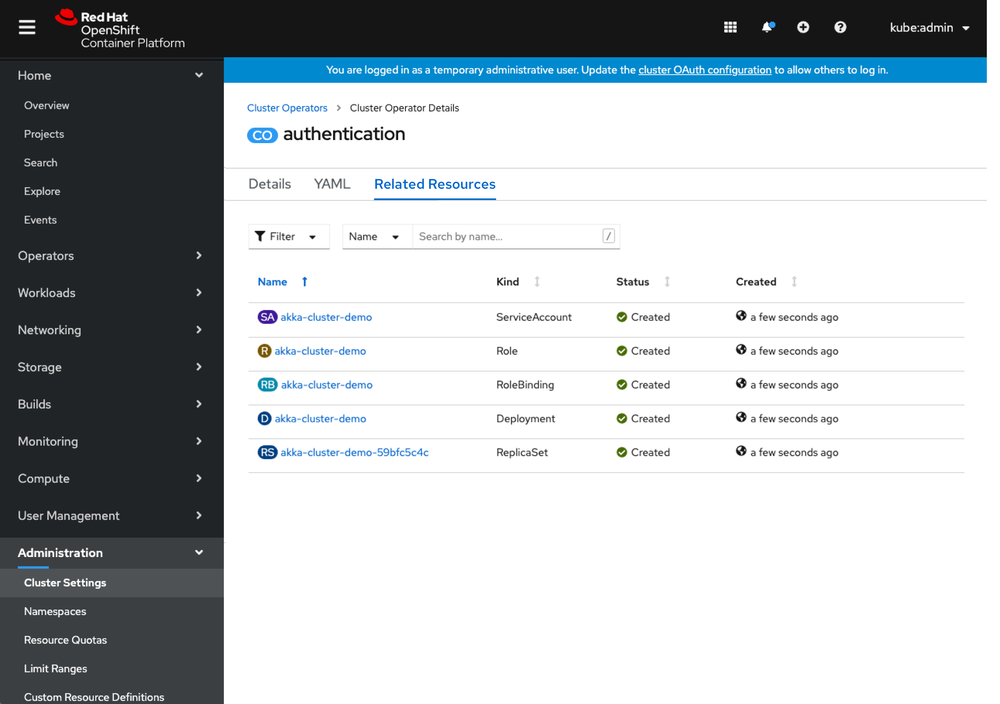

# Connect cluster operators to workloads

When viewing a cluster operator, it isn't clear what resources, RBAC, etc, that it owns and manages.

## Cluster Operator Related Resources

- Cluster operators will have a new ‘Related Resources’ tab that list out the “RelatedObjects” for that operator
- OwnerRef column was considered but usually would be blank