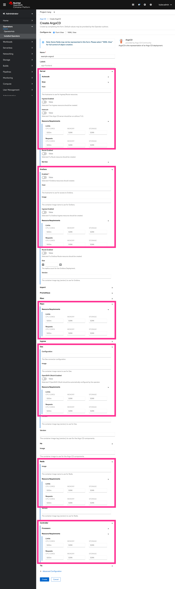

# Test Design

New feature for test

## OperatorHub Filtering

- OperatorHub now has the new facet filter **Infrastructure Features**.
- Existing filtering functionality will be used for this new filter, where if any operator matches one of the selected facets, it will be displayed.
- In the future when the UI can detect what subscriptions the user has, we will likely surface a filter for "subscribed operators" or similar.
